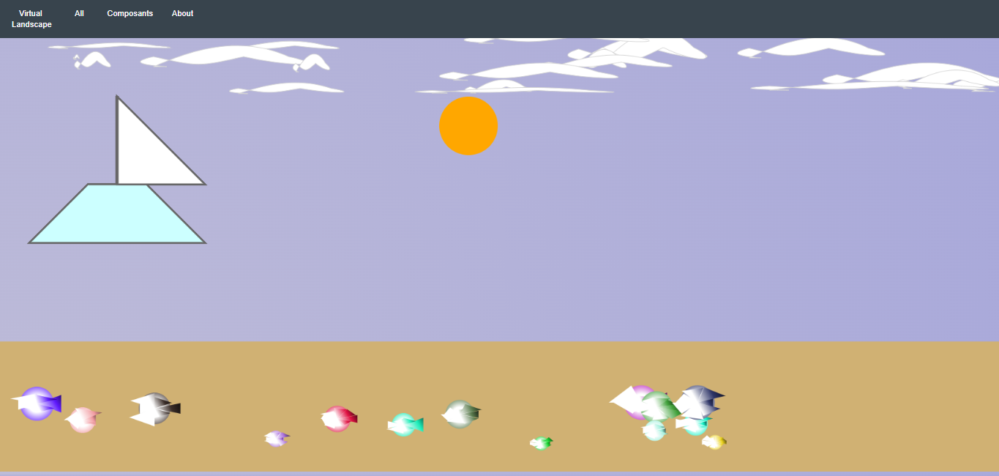
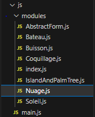
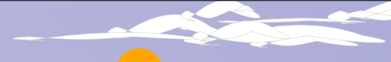

= Compte-rendu VIRTUAL-LANDSCAPE 

== SOMMAIRE
. Contexte
. Introduction
. Détail du Code
. Conclusion
.. histoire

[%header%footer,cols="2,2s,1",grid=rows,frame=topbot,width=100%,caption=Organisation]
|===
|Nom | |Github

|Ben Boubaker Sheinez
^m|
|https://github.com/Sheinezbenbk

3+^.e|auteure du projet 
|===

====== Date : 10/05/2023

== CONTEXTE
ce projet à pour but de découvrir un nouvel élément qui est le *canvas*, c'est un composant du langage Web HTML qui permet d'effectuer des rendus dynamiques d'images bitmap en utilisant des scripts dans des langages. _Dans ce projet nous utiliserons javascript_

== INTRODUCTION 

Dans un premier temps, nous avons récupérer le dossier zip sur lequel ce situe une partie de notre projet (https://github.com/ldv-melun/virtual-landscape) et que nous allons le modifier à partir de notre imagination. 

voici mon rendu finale : 

== DETAILS DU CODE 

pour cette partie, nous allons prendre une partie du code Nuage pour analyser sa forme.

Le fichier Nuage est situé dans le dossier *modules* qui est lui, situé dans *JS*

Chaque fichier contient ce début de code : 
[source,java]
----
import { AbstractForm } from './AbstractForm.js';
----

Ce code importe la classe `AbstractForm` depuis le fichier `AbstractForm.js` dans le même répertoire, en utilisant la syntaxe d'importation nommée de JavaScript. Cela permet d'utiliser la classe `AbstractForm` dans le reste du fichier en utilisant l'identifiant local `AbstractForm`.

Ensuite, nous allons ajouter la suite qui va nous permettre de faire le dessin du nuage : 

[source, java]
----
export class Nuage extends AbstractForm {
constructor(
x = 0,
y = 0,
width = 0,
height = 0,
fillColor = '',
strokeColor = '',
strokeWidth = 2,
pesenteur = false,
ordreConstruction = 100
) {
super(x, y, width, height, fillColor, strokeColor, strokeWidth, pesenteur, ordreConstruction)
}
draw(ctx) {
super.draw(ctx)
ctx.save()
}}
ctx.beginPath()
ctx.strokeStyle = this.strokeColor

ctx.moveTo(this.x, new_y + this.height/2)
ctx.bezierCurveTo(this.x + this.width/4, new_y, this.x + this.width/2, new_y - this.height/4, this.right - this.width/4, new_y + this.height/4)
ctx.bezierCurveTo(this.right, new_y + this.height/2, this.right - this.width/4, new_y + this.height/2, this.right - this.width/2, new_y + this.height/4)
ctx.bezierCurveTo(this.right - this.width*3/4, new_y + this.height/2, this.x + this.width/4, new_y + this.height/2, this.x, new_y + this.height/4)
ctx.bezierCurveTo(this.x - this.width/4, new_y + this.height/2, this.x + this.width/4, new_y + this.height/2, this.x, new_y + this.height/2)
ctx.closePath()

// dessine le nuage
ctx.fill()
ctx.strokeStyle = 'lightgray';
ctx.stroke()

// restores the styles from earlier
ctx.restore()

----

De plus, pour plus d'originalité on entre une fonction statique appelée "buildForms". Voici une explication de ce que cette fonction fait :
 
* Elle crée une instance d'un objet "Nuage" avec des paramètres spécifiques, tels que la largeur, la hauteur, la couleur de remplissage et la couleur de bordure.

* Elle génère un nombre aléatoire "max" compris entre 20 et 29.

* Elle crée un tableau vide appelé "forms".

* Elle boucle "max" fois et à chaque itération, elle crée une nouvelle instance d'un objet "Nuage" avec des propriétés aléatoires pour les coordonnées x et y, la largeur et la hauteur. Les valeurs de ces propriétés sont calculées à l'aide de la fonction Math.random() et en utilisant les valeurs de propriétés de l'objet "myNuage" créé précédemment.

* Elle ajoute chaque nouvel objet "Nuage" créé dans le tableau "forms".  

[source, java]
----
static buildForms() {
const myNuage = new Nuage(800, 100, 150, 100, 'white', 'white', 2, false)
let max = ~~(Math.random() * 10) + 20 // max in [5..10]
let forms = []
for (let i = 0; i < max; i++) {
forms.push(
new Nuage(
~~(Math.random() * 3 * myNuage.x + 80),
~~(Math.random() * myNuage.y),
~~(Math.random() * 3 * myNuage.width + 10),
~~(Math.random() * myNuage.height + 10),
myNuage.fillColor,
myNuage.strokeColor,
'',

)
)
}
return forms
}
----

En résumé, cette fonction crée une liste de formes nuageuses avec des propriétés aléatoires en utilisant un objet "Nuage" de base comme modèle pour leur apparence.

== CONCLUSION 

----
l'histoire de mon rendu final :

le tout de mon projet présente une petite histoire d'un bâteau volant à la recherche des coquillage magique, ils détiennent un pouvoir qui spécifique et qui sera grandement utile pour conquérir l'île à buisson !  
----

Pour conclure, ce projet nous as permi de développer notre créativité tout en découvrant le canvas. 

lien du projet : https://github.com/sheinezbenbk/virtual-landscape.git

